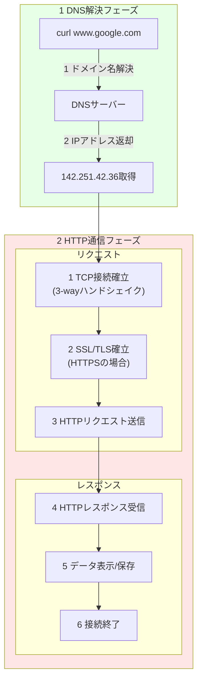
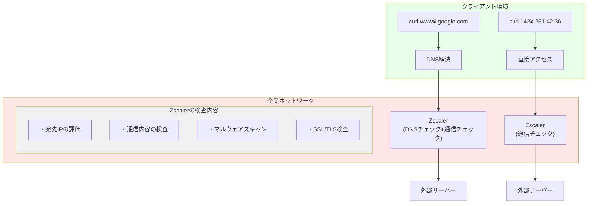
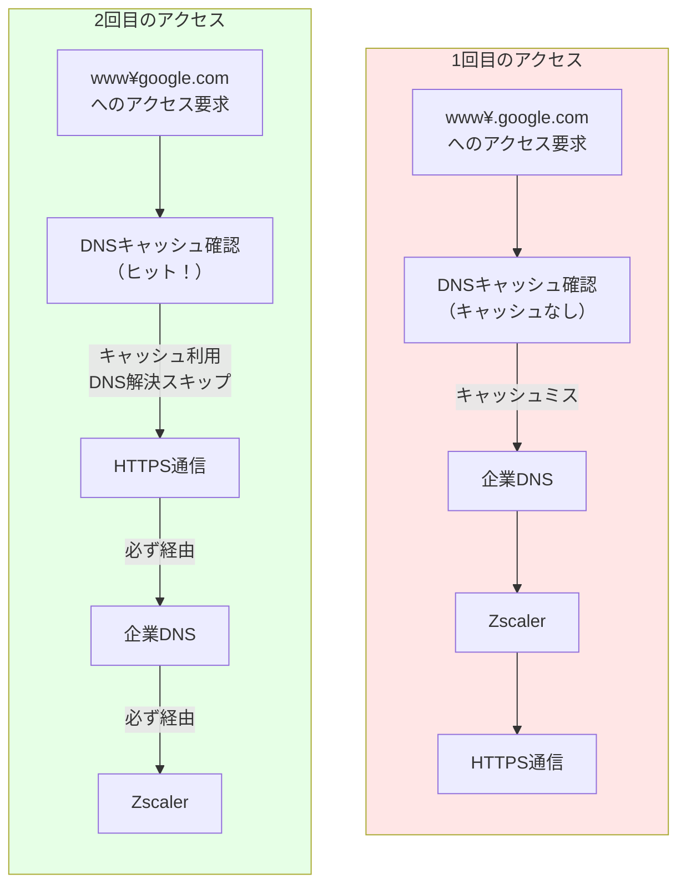

じゃあさ、IPアドレスで直接curlしたら、Zscaler行かないのでは？

実はZscalerはすべての外部通信をチェックします。DNSだけでなく、IPアドレスへの直接アクセスも監視対象です：




IPアドレスへの直接アクセスの場合も以下のような処理が行われます：

### 振り分け
- すべての外部通信は企業のネットワークポリシーに従って処理
- IPアドレスの範囲に基づいて、社内向け/外部向けの振り分けを実施
- 社内IPアドレス範囲への通信は企業内部のネットワークへ
- 外部IPアドレスへの通信はZscalerを経由

### キャッシュ
- DNSキャッシュとは異なり、IPアドレスへの直接アクセスの結果は通常のWebプロキシキャッシュとして処理
- Zscalerでコンテンツのキャッシュが可能（設定による）
- ただし、セキュリティチェックは毎回実施
- キャッシュの有効期限や条件は企業のポリシーに依存

つまり、DNSを使用するかIPアドレス直接指定かに関わらず、企業のセキュリティとネットワークポリシーは一貫して適用されます。


DNSの後HTTPS通信の場合は、IPアドレスがDNSキャッシュに保存されているからDNSキャッシュされたIPアドレスに直接リクエスト

www.google.com → 142.251.42.36（IPアドレス）をDNSキャッシュに保存

DNS解決
plaintextCopywww.google.com → 142.251.42.36（IPアドレス）をDNSキャッシュに保存

その後のHTTPS通信
```plaintext
- DNSキャッシュされたIPアドレスに直接リクエスト
- 142.251.42.36:443へTCP接続
- SSL/TLS確立
- HTTP通信開始
```

```plaintext
- DNS解決をスキップ
- キャッシュされたIPアドレスに直接アクセス
- ただし、Zscalerによるセキュリティチェックは毎回実施
```

```
クライアント
↓
企業ネットワーク（振り分け）
↓
Zscaler（必ず通る）
  - セキュリティチェック
  - SSLインスペクション
  - コンテンツフィルタリング
↓
インターネット
```
理由：

ネットワーク構成
すべての外部通信は強制的にZscalerを経由するよう設定
直接の外部アクセスはファイアウォールでブロック


セキュリティ要件
毎回の通信を検査する必要がある
キャッシュされたIPアドレスを使用しても、通信内容の検査は必須
悪意のある通信を検出するため、すべての通信をモニタリング

つまり、DNSの名前解決はキャッシュを使えますが、実際の通信（HTTPS等）は必ずZscalerのチェックを受けます。これは企業のセキュリティポリシーの重要な要素です。

```
DNSの名前解決は、ローカルにキャッシュされていれば、キャッシュを参照し、HTTPSリクエストを開始するので、行われないが、HTTPSリクエストは、必ず企業DNS、Zscalerを経由する
```



DNS解決
```plaintext
キャッシュあり：
- ローカルキャッシュから即座にIPアドレス取得
- DNS問い合わせはスキップ

キャッシュなし：
- 企業DNS
- Zscaler
- 外部DNSの順で解決
```

HTTPS通信
```plaintext
毎回必ず：
- 企業ネットワーク経由
- Zscalerでのセキュリティチェック
- SSLインスペクション
```

```
このエラーの原因を考察すると：

1. **通信経路の確認**
- WSLのcurlコマンドは、wsl-vpnkit経由でWindowsのネットワーク設定を使用
- その後、Zscalerプロキシを経由して外部サイトにアクセス

2. **証明書の問題**
- エラーメッセージは「local issuer certificate」が取得できない状態を示している
- Zscalerは SSL/TLS 通信を検査するため、独自の証明書を使用
- この証明書はWindows証明書ストアに正しくインストールされている必要がある

3. **考えられる原因**
- Windows証明書ストアにZscalerのルート証明書が正しくインストールされていない
- または、証明書が期限切れや無効になっている
- wsl-vpnkitは正常に動作しているが、Windows側の証明書設定に問題がある

したがって、このエラーはWSL Ubuntuの問題ではなく、Windows側のZscaler関連の証明書設定が原因である可能性が高いです。IT部門に証明書の状態を確認することをお勧めします。
```

WSL UbuntuのCurlコマンドがSSL通信時の証明書を探しに行くプロセスを考えると：

通常のUbuntuの場合

```plaintext
curl → /etc/ssl/certs/ を参照
```

wsl-vpnkitを使用している場合

```plaintext
curl → wsl-vpnkit → Windows証明書ストア を参照
Ubuntuの証明書ストアは参照しない
```
したがって、このエラーは実は、

Ubuntuの証明書ストアを見に行こうとしているのではなく
wsl-vpnkitを通じてWindows証明書ストアを参照しようとしている
その過程でZscaler証明書の問題に遭遇している

ということになります。Ubuntuの証明書設定は関係なく、Windows側の証明書の問題を解決する必要があります。 
