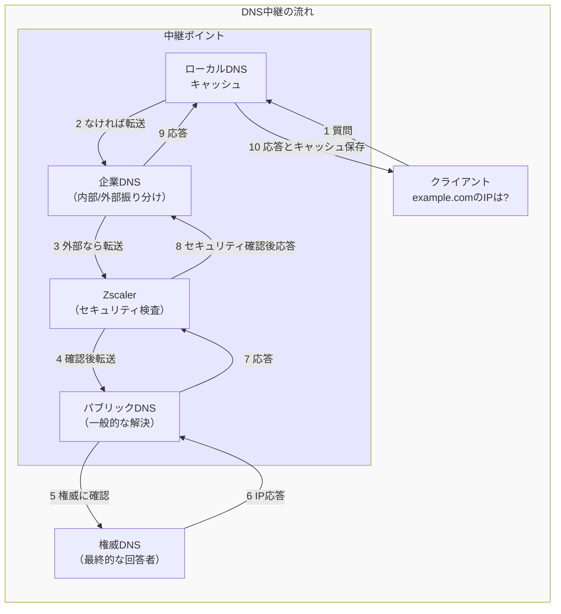
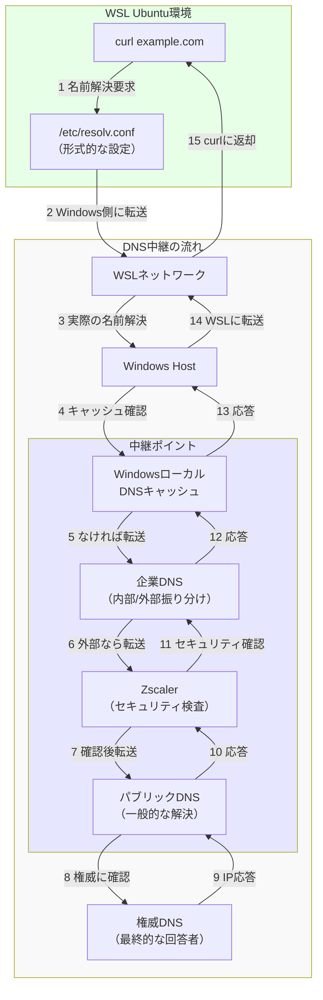
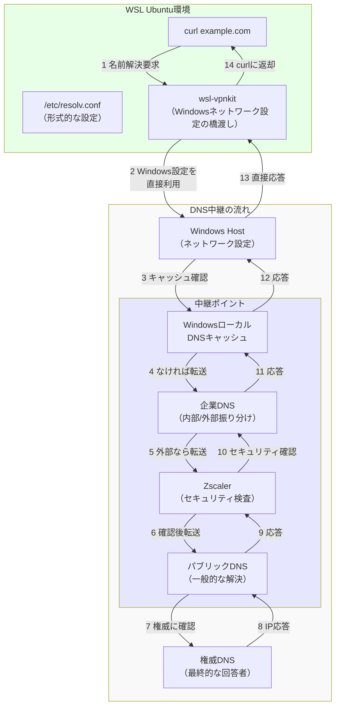
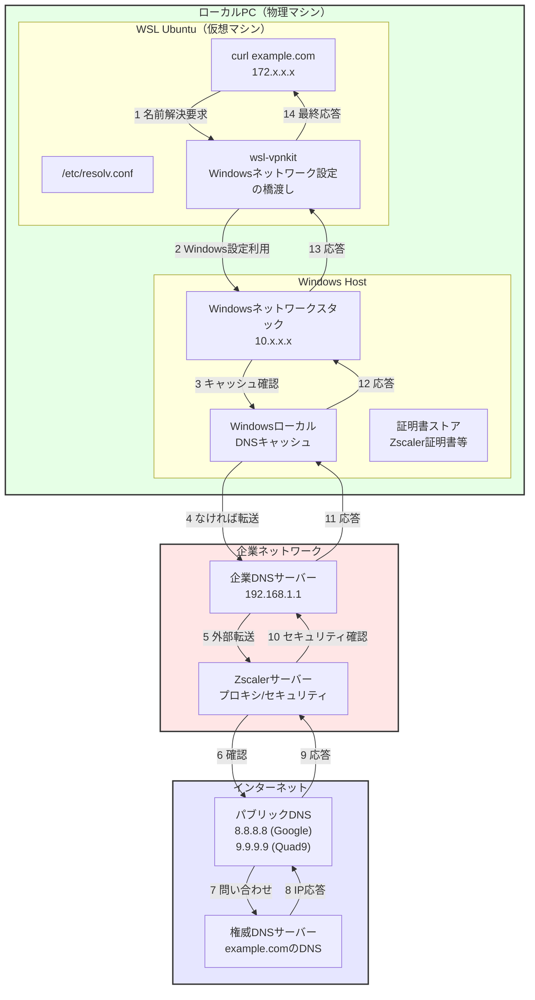

はい、DNSは基本的に中継地点として機能します。以下のように理解するとわかりやすいです：

### DNSの中継の仕組み







### 各DNSの中継役割

1. **ローカルDNSキャッシュ（最初の中継所）**
```plaintext
入口: クライアントからの問い合わせ
出口: 
- キャッシュあり → 直接応答
- キャッシュなし → 企業DNSへ転送
```

2. **企業DNS（交通整理係）**
```plaintext
入口: ローカルDNSからの問い合わせ
振り分け:
- 社内ドメイン → 直接応答
- 外部ドメイン → Zscalerへ転送
```

3. **Zscaler（検問所）**
```plaintext
入口: 企業DNSからの外部向け問い合わせ
処理:
- セキュリティチェック
- フィルタリング
出口: パブリックDNSへ転送
```

4. **パブリックDNS（道案内人）**
```plaintext
入口: Zscalerからの問い合わせ
処理:
- 権威DNSの場所を把握
- 適切な権威DNSへ転送
```

5. **権威DNS（最終応答者）**
```plaintext
入口: パブリックDNSからの問い合わせ
処理:
- 正式なIPアドレスを回答
- 中継経路を逆にたどって応答
```

### 中継の特徴
```plaintext
1. 各DNSの役割
- 情報の転送
- 必要な処理の追加
- 次の中継先の選択

2. 中継の利点
- 負荷分散
- セキュリティ確保
- 効率的な情報伝達

3. 応答の流れ
- 往路: 質問を転送
- 復路: 応答を転送
```



このように、DNSは単なる名前解決だけでなく、情報を適切に中継しながら必要な処理を加えていく仕組みとなっています。中継することで、セキュリティ、効率性、管理性を向上させています。