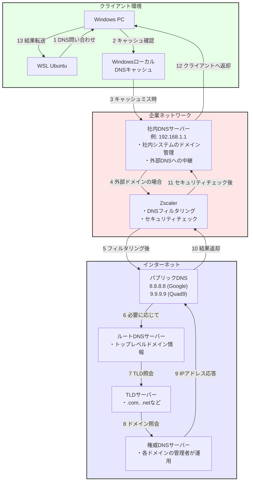

企業環境での階層的なDNS構造

```mermaid
graph TB
    subgraph Client["クライアント環境"]
        windows["Windows PC"]
        wsl["WSL Ubuntu"]
        cache["Windowsローカル<br>DNSキャッシュ"]
    end

    subgraph Company["企業ネットワーク"]
        cdns["社内DNSサーバー<br>例: 192.168.1.1<br>・社内システムのドメイン管理<br>・外部DNSへの中継"]
        zscaler["Zscaler<br>・DNSフィルタリング<br>・セキュリティチェック"]
    end

    subgraph Internet["インターネット"]
        root["ルートDNSサーバー<br>・トップレベルドメイン情報"]
        tld["TLDサーバー<br>・.com, .netなど"]
        auth["権威DNSサーバー<br>・各ドメインの管理者が運用"]
        pdns["パブリックDNS<br>8.8.8.8 (Google)<br>9.9.9.9 (Quad9)"]
    end

    %% クエリの流れ
    wsl -->|"1 DNS問い合わせ"| windows
    windows -->|"2 キャッシュ確認"| cache
    cache -->|"3 キャッシュミス時"| cdns
    cdns -->|"4 外部ドメインの場合"| zscaler
    zscaler -->|"5 フィルタリング後"| pdns
    
    pdns -->|"6 必要に応じて"| root
    root -->|"7 TLD照会"| tld
    tld -->|"8 ドメイン照会"| auth
    
    auth -->|"9 IPアドレス応答"| pdns
    pdns -->|"10 結果返却"| zscaler
    zscaler -->|"11 セキュリティチェック後"| cdns
    cdns -->|"12 クライアントへ返却"| windows
    windows -->|"13 結果転送"| wsl

    %% スタイル
    classDef client fill:#e6ffe6,stroke:#333,stroke-width:2px;
    classDef company fill:#ffe6e6,stroke:#333,stroke-width:2px;
    classDef internet fill:#e6e6ff,stroke:#333,stroke-width:2px;
    
    class Client client;
    class Company company;
    class Internet internet;
```