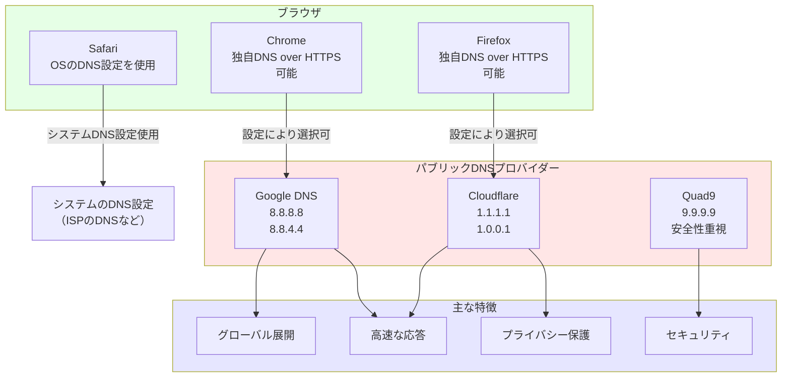

```mermaid
graph TB
    subgraph Browsers["ブラウザ"]
        safari["Safari<br>OSのDNS設定を使用"]
        chrome["Chrome<br>独自DNS over HTTPS<br>可能"]
        firefox["Firefox<br>独自DNS over HTTPS<br>可能"]
    end

    subgraph DNS["パブリックDNSプロバイダー"]
        google["Google DNS<br>8.8.8.8<br>8.8.4.4"]
        cloudflare["Cloudflare<br>1.1.1.1<br>1.0.0.1"]
        quad["Quad9<br>9.9.9.9<br>安全性重視"]
    end

    subgraph Features["主な特徴"]
        speed["高速な応答"]
        security["セキュリティ"]
        privacy["プライバシー保護"]
        global["グローバル展開"]
    end

    safari -->|"システムDNS設定使用"| system["システムのDNS設定<br>（ISPのDNSなど）"]
    chrome -->|"設定により選択可"| google
    firefox -->|"設定により選択可"| cloudflare
    
    google --> speed
    google --> global
    cloudflare --> privacy
    cloudflare --> speed
    quad --> security

    style Browsers fill:#e6ffe6
    style DNS fill:#ffe6e6
    style Features fill:#e6e6ff
```